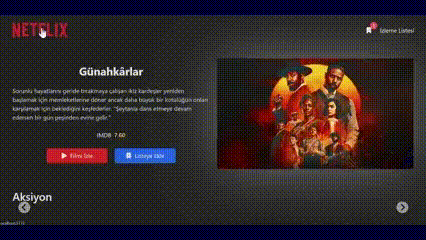

<h1>🎬 Netflix Klon Projesi </h1>

Bu proje, React ve Redux kullanarak geliştirilmiş bir Netflix klonu uygulamasıdır. Film detaylarını, kategorilerini, yapımcı bilgilerini ve izleme listesi özelliklerini içerir. Modern web teknolojileri ile kullanıcı dostu ve duyarlı bir arayüz sunar.

## Özellikler

<ul style="list-style-type: disc;">
  <li>Film kategorileri, diller, yapımcı şirketler ve ülkeler bilgisi</li>
  <li>Film detay sayfası (özellikler, IMDB puanı, bütçe, hasılat)</li>
  <li>Redux ile global state yönetimi</li>
  <li>Kullanıcıların filmleri izleme listesine ekleyip çıkarabilmesi</li>
</ul>

## Teknolojiler
<ul style="list-style-type: disc;">
<li> React  </li>
<li> Redux Toolkit  </li>
<li> Tailwind CSS  </li>
<li>Vite  </li>
<li> millify (büyük sayılar için kolay gösterim) </li>
</ul>

📁 

Ortam Değişkenleri (.env)
Projeyi çalıştırmadan önce kök dizine bir .env dosyası oluşturmalısınız.
Aşağıdaki adımları takip edebilirsiniz:

  bash

cp .env.example .env

Oluşan .env dosyasını kendi API bilgilerinizle doldurun:

VITE_API_KEY=

VITE_BASE_URL=

## Proje Görseli

🎬

# netflix-clone-redux
